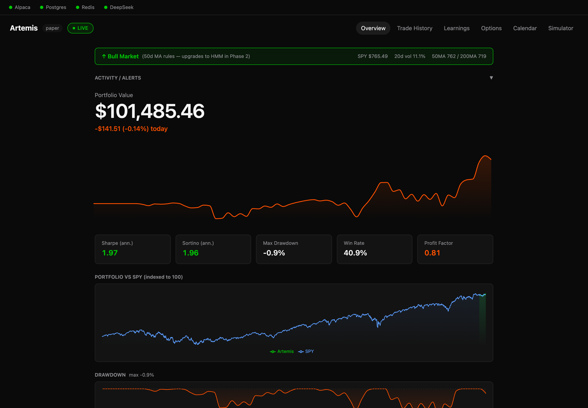
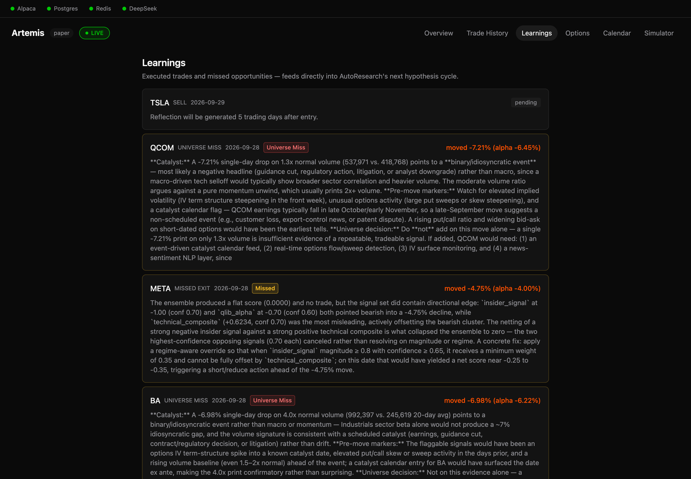
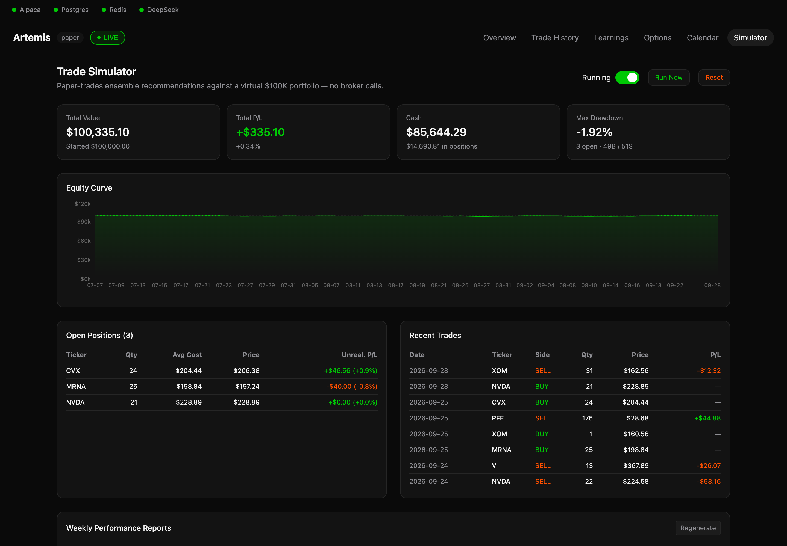
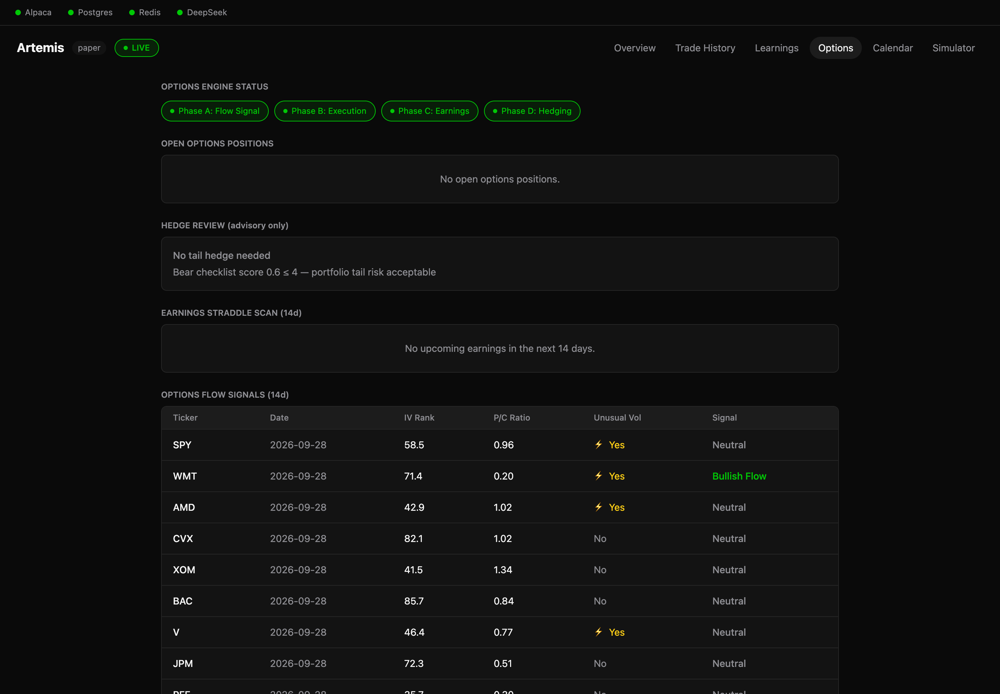
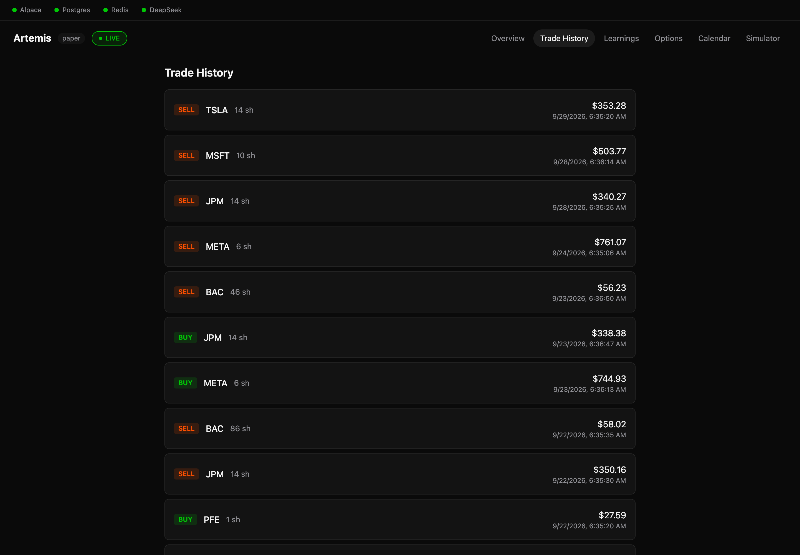

# Artemis

**An open-source, AI-assisted trading research system for US equities, built for paper trading.**

Artemis collects market, news, macro, insider and options-flow data every day. It turns that
data into about a dozen signals, blends them into target portfolio weights, and can send limit
orders to an [Alpaca](https://alpaca.markets) **paper** account behind a layered set of risk
checks. After each trading day it reviews the day's biggest moves, including the ones it missed,
and feeds those lessons into a self-improvement loop.

A local web dashboard shows the portfolio, trades, what the system learned, options flow and a
$100k virtual-portfolio simulator.

> [!WARNING]
> **This is research software, not a money-making product.** Backtests so far show **no
> statistically credible edge** (see [Drawbacks](#drawbacks--limitations)). It is built and tested
> for **paper trading only**. Nothing here is financial advice.

---

## Screenshots

| Overview | Learnings |
|---|---|
|  |  |
| **Simulator** | **Options flow** |
|  |  |

<details>
<summary>Trade history</summary>


</details>

---

## What it does

### 1. Collects data (daily, after the close)
- **Prices**: daily OHLCV from Alpaca (Polygon as fallback) for 20 tickers you trade plus 26
  more that are only watched
- **News**: RSS headlines · **Macro**: FRED · **Fundamentals** · **Insider trades**: Finnhub
- **Options flow**: put/call ratio, IV rank and unusual-volume flags

### 2. Generates signals, each scaled to −1 … +1
| Signal | What it measures |
|---|---|
| `technical_composite` | RSI, MACD, Bollinger %B, SMA cross, OBV |
| `qlib_alpha` | LightGBM cross-sectional return model, retrained weekly |
| `sentiment_1d / 7d` | News sentiment, averaged over 1 and 7 days |
| `llm_sentiment` | DeepSeek reading of recent headlines |
| `insider_signal` | Net insider buying or selling |
| `options_flow_signal` | Put/call ratio, adjusted up for high IV rank and unusual volume |
| `volume_anomaly_signal` | Today's volume against its 20-day average (an early warning of catalysts) |
| `short_interest_signal`, `regime_overlay` | Short-squeeze pressure; bull/bear/sideways regime |

### 3. Decides
An **ensemble** combines the signals with configurable weights. The weights are stored in the
database and adjusted by AutoResearch. A **bull/bear/judge LLM debate** can check a trade idea
before it's taken. Position sizing is volatility-targeted, with caps on single-position size,
sector share and correlation.

### 4. Executes safely (paper)
Every order goes through a single **fail-closed pre-trade gate**:
- Limit orders only (never market orders)
- Caps on order quantity and dollar size, and a price collar
- Rejects stale quotes, and orders placed while the market is closed
- Per-minute rate limit, plus idempotent order IDs so an order can't be sent twice

Portfolio-level **halts freeze trading** on a −3% day, a −15% drop from peak, or 3 losing days
in a row. They also freeze it when the local records and the broker disagree, or when cash or
leverage limits are breached. The **kill switch** (a dashboard button) blocks new orders and
cancels any open ones.

### 5. Learns
- **Post-trade reflections**: 5 trading days after each trade, an LLM writes up what worked and
  what didn't.
- **End-of-day mover analysis**: every day, the biggest movers the system did *not* trade get a
  write-up of which signals were available, which misled, and what threshold change would have
  caught the move. Tickers outside the trading universe are logged as **Universe Miss**.
- **AutoResearch**: proposes hypotheses, runs experiments, and promotes changes only after
  shadow and burn-in periods, with automatic rollback.

### 6. Validates
`src/validation/` contains walk-forward analysis, combinatorial purged cross-validation (CPCV),
the deflated Sharpe ratio, probability of backtest overfitting (PBO), Hansen's SPA test, a
parameter-stability test, a regime-robustness test and event studies. That's an 8-gate scorecard
a strategy has to pass before you should trust it.

---

## Quick start

**You need:** macOS or Linux · Python **3.11–3.13** · Node **20+** · Docker *or* PostgreSQL 14+ ·
a free [Alpaca paper account](https://app.alpaca.markets/signup)

```bash
git clone https://github.com/sgaidreams-del/artemis-hedgefund.git
cd artemis-hedgefund
./install.sh
```

The installer walks you through everything:

1. It checks prerequisites and creates a Python virtualenv.
2. It installs Python and dashboard packages. The first run downloads about 2 GB, mostly PyTorch.
3. **It asks for your API keys one at a time.** Secrets are hidden while you type and checked
   live against each provider. They're written only to `.env`, which is git-ignored and readable
   only by you (mode 600).
4. It generates a random database password and sets up PostgreSQL, either in Docker or on your
   existing local Postgres.
5. It runs a health check and optionally downloads 2 years of price history.

Then start the dashboard:

```bash
./start.sh        # → http://localhost:5173
```

### API keys

| Service | Needed? | Cost | Used for |
|---|---|---|---|
| [Alpaca](https://app.alpaca.markets/signup) | **Required** | Free (paper) | Broker, prices, account |
| [DeepSeek](https://platform.deepseek.com/) | Recommended | Pay-as-you-go, a few cents a day | LLM sentiment, debate, reflections, mover analysis |
| [Finnhub](https://finnhub.io/register) | Optional | Free tier | Insider trades, earnings calendar |
| [FRED](https://fred.stlouisfed.org/docs/api/api_key.html) | Optional | Free | Macro indicators |
| [Polygon](https://polygon.io/pricing) | Optional | Paid | Fallback price feed |
| [Reddit](https://www.reddit.com/prefs/apps) | Optional | Free | Social sentiment |

Features whose keys are missing are skipped rather than failing. To add or rotate keys later,
run `./install.sh --keys` (press Enter to keep a current value).

---

## Everyday use

| Task | Command |
|---|---|
| Start the dashboard | `./start.sh` |
| Run the daily data + signal pipeline | `.venv/bin/python scripts/run_pipeline.py` |
| Preview today's rebalance (**submits nothing**) | `.venv/bin/python scripts/run_daily_trade.py` |
| Submit today's rebalance (asks you to type `yes`) | `.venv/bin/python scripts/run_daily_trade.py --live` |
| Run the 5-year walk-forward backtest | `.venv/bin/python scripts/run_walkforward_backtest.py` |
| Schedule the pipeline daily (macOS) | `scripts/launchagent_setup.sh` |
| Check infrastructure | `.venv/bin/python scripts/health_check.py` |
| Run tests | `.venv/bin/python -m pytest` (install with `./install.sh --dev`) |

A typical day: the **pipeline** runs after the close. It collects data, computes signals and
ensemble scores, writes reflections and the missed-mover analysis, snapshots the portfolio and
steps the simulator. The next morning you **preview** the rebalance and decide whether to submit
it. The dashboard's **Simulator** tab paper-trades every recommendation with no broker calls at
all, so you can judge the strategy before letting it touch even a paper account.

See **[docs/USAGE.md](docs/USAGE.md)** for the full operations guide. It covers the pipeline
jobs, the kill switch, halts, the simulator, universe configuration, scheduling and
troubleshooting.

### Configuration

| File | What's in it |
|---|---|
| `.env` | API keys, database connection, feature flags (options execution is **off** by default) |
| `config/universe.yaml` | Tickers to trade (`seed_tickers`) and tickers only watched (`extended_watchlist`) |
| `config/settings.yaml` | Risk limits, position sizing, pre-trade gate thresholds, AutoResearch cadence |

---

## Architecture

```
               ┌──────────────── daily pipeline (scripts/run_pipeline.py) ────────────────┐
 Alpaca/Polygon│  collectors ─► feature store ─► signals ─► ensemble ─► reflections/EOD   │
 News/FRED     │  (src/data)                     (src/signals) (src/strategy) (memory)    │
 Finnhub/yf    └───────────────────────────────┬──────────────────────────────────────────┘
                                               │   PostgreSQL (29 tables)
      run_daily_trade.py / dashboard button ───┤
                                               ▼
        risk sizing ─► pre-trade gate ─► order router ─► Alpaca (paper)
        (src/risk)     (fail-closed)     (limit-only)
                                               │
        FastAPI (dashboard_api/) ◄─────────────┘──► React + Vite dashboard (dashboard/)
```

| Path | Contents |
|---|---|
| `src/data/` | Collectors, data-quality watchdog, feature store, universe |
| `src/signals/` | Technical, sentiment, LLM, regime, alternative-data signals |
| `src/strategy/` | Alpha model, ensemble, bull/bear debate, trade memory and reflections |
| `src/risk/` | Position sizing, rebalancer, pre-trade gate, limits, reconciliation |
| `src/execution/` | Broker wrapper, order routing, daily trader, options |
| `src/validation/` | Backtest engine, walk-forward, overfitting gates, event studies |
| `src/autoresearch/` | Hypothesis → experiment → promotion loop, research journal |
| `src/simulation/` | $100k virtual portfolio |
| `dashboard_api/`, `dashboard/` | Local web dashboard (FastAPI + React) |
| `SPEC.md` | Original design specification (long; not every section is implemented) |

---

## Drawbacks & limitations

Please read these before relying on anything this system produces.

**The strategy has no demonstrated edge.** The 5-year walk-forward backtest of the parts that can
be reconstructed historically (technical composite + LightGBM alpha) gave these results:

- Out-of-sample Sharpe averaged **0.13**, positive in only 2 of 5 windows.
- The static backtest Sharpe was **−0.07**.
- Only **1 of 8** overfitting and significance gates passed.
- SPY buy-and-hold scored a **0.72** Sharpe over the same window.

Treat Artemis as a framework for testing ideas, not a strategy that works.

**Much of the live strategy can't be backtested.** LLM sentiment, insider, options-flow and news
signals have no historical archive to replay. Their value is only visible going forward, and a
few weeks of live history proves little.

**LLMs add variability and risk.**
- DeepSeek outputs aren't deterministic, so the same inputs can produce different scores.
- News headlines are fed into LLM prompts, so a crafted headline could in principle nudge a
  signal (prompt injection). The risk gate limits the damage but can't prevent it.
- API calls cost money, and when your credit runs out the LLM features silently stop.

**Data quality is limited on free tiers.**
- Alpaca's free IEX feed covers only part of market volume and can lag.
- Some options IV and ticker metadata comes from `yfinance`, an unofficial scraper that can break
  without warning.
- There is no survivorship-bias-free universe.

**Some metrics and modules are approximate or incomplete.**
- Overview *Win Rate* and *Profit Factor* are proxies computed from individual fills, not matched
  buy/sell pairs.
- The FinRL reinforcement-learning agent is disabled by default.
- There's no options Greeks engine, so the delta-exposure cap is mechanism-only.
- Discord reporting is legacy code.

**Timing is coarse.** Artemis uses daily bars and rebalances at most once a day. It can't react to
intraday moves; the MRNA-style +170% gap it logs as a "Universe Miss" happened in one session.

**Paper fills are optimistic.** Alpaca paper trading doesn't model queue position, partial fills
or market impact the way live markets do.

**It's single-user and local.** The dashboard has no login. It's protected against cross-site
requests and DNS rebinding, but it **must not be exposed to a network**. See
[SECURITY.md](SECURITY.md).

**It's heavy and macOS-first.**
- The install is about 2 GB of Python dependencies.
- Scheduling helpers are macOS LaunchAgents; on Linux you use cron, and Windows is untested
  (try WSL).
- The trader agent's schedule assumes the machine clock is on US Pacific time.

**Live trading is unsupported.** You *can* point `ALPACA_BASE_URL` at a live endpoint, but
nothing in this repo has been validated for real money. Don't.

---

## Unattended trading (opt-in, not recommended)

By default Artemis never places an order unless you tell it to, either with
`run_daily_trade.py --live` (which asks for confirmation) or with a dashboard button. On macOS
there is an optional LaunchAgent that submits the rebalance every weekday morning with nobody
watching:

```bash
scripts/launchagent_setup.sh --with-trader   # asks you to type a confirmation phrase
scripts/launchagent_setup.sh --uninstall     # removes all Artemis agents
```

Only consider this on a paper account. The kill switch and loss halts still apply. The installer
never turns this on for you.

---

## Security

See **[SECURITY.md](SECURITY.md)** for the threat model, the results of the pre-release security
audit, and how to report a vulnerability. The short version:

- Keys live only in `.env` (mode 600, git-ignored).
- Every service binds to `127.0.0.1`.
- State-changing API calls need a same-origin header.
- Orders pass the fail-closed gate.

## Disclaimer

This software is provided for educational and research purposes only. It is **not** investment,
financial, legal or tax advice, and no one involved in it is a licensed financial adviser.
Trading involves substantial risk of loss. Past or simulated performance doesn't predict future
results. You're solely responsible for any use of this software and for any orders it submits
on your behalf.
